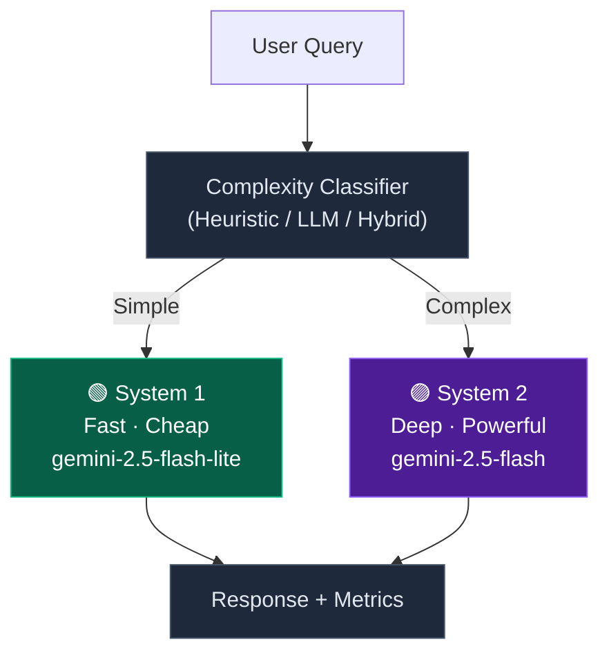

# Smart LLM Router

> Intelligent query routing inspired by Daniel Kahneman's **System 1 / System 2** thinking model. Route simple queries to fast, cheap models and complex ones to powerful models — automatically.


---

## The Problem

Every LLM API call costs money and time. But not every question needs GPT-4 or Gemini Pro:

| Query | What you actually need |
|-------|----------------------|
| "Hello!" | Fast, cheap model (< 0.1s, ~$0.00001) |
| "Write a merge sort with complexity analysis" | Powerful model (~2s, ~$0.002) |

Most applications send **every** query to the same expensive model, wasting money on simple tasks and sometimes waiting unnecessarily.

## The Solution

Smart LLM Router analyzes each query's complexity in real-time and routes it to the optimal model:



**System 1** (Fast Thinking): Greetings, translations, factual lookups → `gemini-2.5-flash-lite`

**System 2** (Deep Thinking): Code generation, analysis, multi-step reasoning → `gemini-2.5-flash`

## Key Features

- **3 Classification Strategies**: Heuristic (zero API calls), LLM-based, or Hybrid (best of both)
- **Multi-Provider Support**: Google Gemini, OpenAI, Groq — any OpenAI-compatible API
- **Real-Time Metrics Dashboard**: Track requests, latency, costs, and token usage
- **Cost Transparency**: Every response shows estimated cost and token breakdown
- **Automatic Fallback**: If the fast model fails, seamlessly escalates to the powerful model
- **Session Persistence**: Browser localStorage for response history across sessions
- **Production-Ready UI**: Markdown rendering, copy-to-clipboard, health monitoring, responsive design

## Architecture

```
smart_LLM_router/
├── app/                          # FastAPI Backend
│   ├── main.py                   # App factory, SPA serving
│   ├── config.py                 # Pydantic settings, model pricing
│   ├── models.py                 # Request/response schemas
│   ├── exceptions.py             # Error hierarchy
│   ├── api/
│   │   ├── routes.py             # POST /route, GET /metrics, GET /health
│   │   └── dependencies.py       # Dependency injection (classifiers, LLM client)
│   ├── classifier/
│   │   ├── heuristic.py          # Rule-based (keywords, regex, signals)
│   │   ├── llm_classifier.py     # LLM-powered classification
│   │   └── hybrid.py             # Heuristic-first, LLM fallback
│   ├── llm/
│   │   └── openai_client.py      # OpenAI-compatible client
│   ├── router/
│   │   └── router.py             # Core: classify → route → generate → record
│   └── metrics/
│       ├── collector.py          # Cost calculation, metric building
│       └── store.py              # Thread-safe in-memory storage
├── frontend/                     # React SPA
│   ├── src/
│   │   ├── App.tsx               # Main app with session persistence
│   │   ├── api.ts                # API client with abort support
│   │   ├── types.ts              # TypeScript interfaces
│   │   └── components/
│   │       ├── Header.tsx        # Health polling, branding
│   │       ├── QueryForm.tsx     # Input with advanced options
│   │       ├── ResponseCard.tsx  # Markdown rendering, copy button
│   │       ├── MetricsDashboard.tsx  # Charts (Recharts), stats
│   │       ├── WelcomeState.tsx  # Example queries
│   │       ├── Toast.tsx         # Notification system
│   │       └── ErrorBoundary.tsx # Crash recovery
│   └── vite.config.ts           # Build + dev proxy
└── tests/                        # 29 tests
    ├── test_classifier.py        # 10 heuristic classification tests
    ├── test_router.py            # 7 routing logic tests
    ├── test_api.py               # 4 endpoint tests
    └── test_metrics.py           # 8 metrics/cost tests
```

## How the Heuristic Classifier Works

The classifier uses a **scoring system** with 7 signal types:

| Signal | System 1 (Simple) | System 2 (Complex) |
|--------|-------------------|-------------------|
| Query Length | <= 5 words: **-0.3** | >= 50 words: **+0.3** |
| Pattern Match | Greetings, factual Q&A: **-0.4** | — |
| Keywords | — | "analyze", "algorithm", "debug": **+0.25 to +0.5** |
| Phrases | — | "write a function", "design a system": **+0.35** |
| Code Detection | — | Code blocks, SQL, imports: **+0.4** |
| Multi-Question | — | 3+ question marks: **+0.2** |
| Math Content | — | 3+ math symbols: **+0.3** |

**Decision**: Score >= 0.3 → System 2 | Score <= -0.2 → System 1 | Between → System 1 (low confidence)

## Quick Start

### Prerequisites
- Python 3.11+
- Node.js 18+
- A Gemini API key ([Get one free](https://aistudio.google.com/apikey))

### Setup

```bash
# Clone the repo
git clone https://github.com/YOUR_USERNAME/smart-llm-router.git
cd smart-llm-router

# Backend
cp .env.example .env
# Edit .env and add your API_KEY
pip install -e ".[dev]"

# Frontend
cd frontend
npm install
npm run build
cd ..

# Run
uvicorn app.main:app --reload
# Open http://localhost:8000
```

### Development Mode (hot reload)

```bash
# Terminal 1: Backend
uvicorn app.main:app --reload

# Terminal 2: Frontend dev server
cd frontend && npm run dev
# Open http://localhost:5173 (proxies API to :8000)
```

### Run Tests

```bash
python -m pytest tests/ -v
```

## API Endpoints

| Method | Endpoint | Description |
|--------|----------|-------------|
| `POST` | `/route` | Classify and route a query |
| `GET` | `/metrics` | Aggregated statistics |
| `GET` | `/health` | Server health + config |

### Example

```bash
curl -X POST http://localhost:8000/route \
  -H "Content-Type: application/json" \
  -d '{"query": "Hello!"}'
```

```json
{
  "answer": "Hello! How can I help you today?",
  "model_used": "gemini-2.5-flash-lite",
  "complexity": "system1",
  "classification_confidence": 0.81,
  "classifier_used": "heuristic",
  "latency_ms": 245.3,
  "token_usage": {"prompt_tokens": 12, "completion_tokens": 18, "total_tokens": 30},
  "estimated_cost_usd": 0.0000042
}
```

## Configuration

All settings via `.env` file or environment variables:

| Variable | Default | Description |
|----------|---------|-------------|
| `API_KEY` | (required) | Your LLM API key |
| `API_BASE_URL` | Gemini URL | OpenAI-compatible endpoint |
| `SYSTEM1_MODEL` | `gemini-2.5-flash-lite` | Fast/cheap model |
| `SYSTEM2_MODEL` | `gemini-2.5-flash` | Powerful model |
| `CLASSIFIER_MODE` | `heuristic` | `heuristic` \| `llm` \| `hybrid` |
| `CONFIDENCE_THRESHOLD` | `0.7` | Hybrid mode: triggers LLM below this |
| `FALLBACK_TO_SYSTEM2` | `true` | Auto-escalate on System 1 failure |

### Multi-Provider Support

```bash
# Google Gemini (default)
API_BASE_URL=https://generativelanguage.googleapis.com/v1beta/openai/

# OpenAI
API_BASE_URL=https://api.openai.com/v1
SYSTEM1_MODEL=gpt-4o-mini
SYSTEM2_MODEL=gpt-4o

# Groq
API_BASE_URL=https://api.groq.com/openai/v1
SYSTEM1_MODEL=llama-3.3-70b-versatile
SYSTEM2_MODEL=deepseek-r1-distill-llama-70b
```

## Tech Stack

| Layer | Technology |
|-------|-----------|
| Backend | Python 3.11, FastAPI, Pydantic, OpenAI SDK |
| Frontend | React 19, TypeScript 5.7, Vite, Tailwind CSS 4 |
| Charts | Recharts |
| Icons | Lucide React |
| Markdown | react-markdown + remark-gfm |
| Testing | pytest, pytest-asyncio |

## License

MIT
